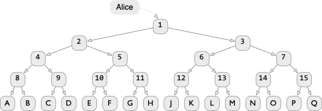

# Structural Sharing

Explanations of structural sharing usually start with simple linked lists, then move on to small binary trees.
That ok, but those examples are a little bit toy-ish and risk giving the impression that the idea of structural sharing doesn't scale up to large, efficient data structures.
So I'm going to use a slightly-bigger-than-tiny tree in an attempt to illustrate the great pwoer of logarithms.

Here's a nice little tree called "Alice" that has 16 letters stored in it.

Now imagine we want to change "K" to be "R".
Obviously if we're willing to change the original value/contents of "Alice", then we can just update the "K" node in-place.
But what if we want both "Alice" as it is __and__ the tree with the update.
Obviously we could make a complete copy of the tree, but that would be painfully expensive.
Instead, we can do __structural sharing__:

THE BIG DEAL: We now have two data structures that are mostly (but not exactly) the same and the storage cost went up by way, way less than a factor of 2.
This magic trick comes with some very important caveats:

1. Notice that there are now 4 subtrees (2, 7, 13, "J") that are part of both Alice and Bob.
This means that an in-place update of any node in any of those subtrees will change the meaning of both Alice and Bob.
Theoretically this could be useful, but in most normal scenarios that would be bad, so for most practical purposes those subtrees need to be considered strictly immutable.
2. Imagine the program wants to reclaim the memory used to store Alice.
This means nodes 1, 3, 6, 12 and "K" should be free'd/collected, but not the subtrees shared with Bob.
The sharing of subtrees going on here necessitates some kind of garbage collection.
As you'll see later in this essay, this gets a little tricky (though not overwhelmingly so) when one allows hybrid mutable/immutable data structures.
