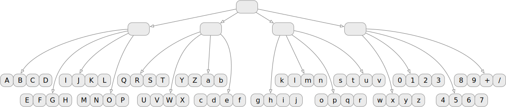

# Xerographic Data Structures

_Because we always need more names for things that have too many names already_

There's an extended family of data structures that goes by several names (each of which has its own subtly distinct set of associations): persistent, immutable, (purely) functional, copy-on-write (🐄), transient.
I don't love any of these terms, and I don't think any of them has quite become a de facto standard.

- _Persistent_: I think this is maybe the most popular term these days (early in the pandemic era).
It would be easier to love "persistent" if it didn't conflict with the mostly unrelated use in databases.
This conflict means that presenters always have to do a little "I don't mean persistent like databases" spiel.
Not the worst thing ever, but not great either.
- _Immutable_: This term does carry some useful information, but:
  1. It focuses on the negative.
     All other things being equal, why should a programmer prefer a data structure that takes something away (i.e. mutation)?
     Well, all other things are not equal, but let's not get ahead of ourselves.
     Taking some inspiration from [Bob Harper's rants about "dynamic"](https://existentialtype.wordpress.com/2014/04/21/bellman-confirms-a-suspicion/), it's better for names to focus on the positive rather than the negative.
  2. I want to include data structures that are in some sense a immutable/mutable hybrid, and the term "immutable" seems to draw a hard line (Get Rid Of Slimy mutationS).
- _Functional_: This term has more to do with a historical connection to functional programming languages than any direct connection to mathematical functions.
  One thing going for "functional" is its use in the title of Chris Okasaki's classic book [Purely Functional Data Structure](https://www.amazon.com/Purely-Functional-Data-Structures-Okasaki/dp/0521663504).
  But I fear that might not be enough.
- _Copy-on-write_: I do kind of like this term.
  Unfortunately it's strongly associated with fairly _coarse-grained_ implementations of the idea, like pages in virtual memory.
  The important thing about xerographic data structures is that they implement a very fine-grained kind of copy-on-write.

So my quixotic addition to this list of names is _xerographic_ data structures.
The association that this name plays on is the good old photocopy machine.
Photocopiers had a [dramatic impact on the running of offices in the mid 20th century](https://www.smithsonianmag.com/history/duplication-nation-3D-printing-rise-180954332/) by lowering the cost of copying documents.
And that (IMNSHO) is the center of the bullseye for this family of data structures:
They have a dramatic impact on software engineering by __lowering the cost of copying data__.
Thus xerographic.
(Maybe xero or Xerox™ for short; maybe not.)

# Why Cheap Copying is So Important

In this section I'm really not saying anything new.
Programmers have been fighting about mutable vs immutable for generations.
If I have anything to contribute it's this: too often programmers frame this discussion in absolute, near-religious terms.
Like, mutation is a sinful hack, because Alonzo Church said so.
(AFAIK, Chruch never said anything like that.)

I think the case for xerographic data structures can and should be made in terrestrial software engineering terms.
Passing references to mutable data structures around a program [invites accidental coupling](https://www.yegor256.com/2014/06/09/objects-should-be-immutable.html).
And as we all know, [coupling is bad](https://dzone.com/articles/quality-code-is-loosely-coupled).
Using _purely_ functional/immutable data structures avoids this coupling problem.
They let us think about (possibly quite large) lists/sets/maps/etc as [values rather than references to a place in memory where that thing is stored](https://www.infoq.com/presentations/Value-Values/).
([Primer on how structural sharing makes copying cheap](./structural_sharing.md).)
That's great; unfortunately...

# "Cheap" Doesn't Mean "Free"

Textbook implementations (or maybe "CS2 implementations" has better connotations) of xerographic data structures are efficient enough for lots of applications.
Unfortunately, they have _just enough performance overhead to matter_ for some applications with medium- to large-scale data.
This overhead is probably not as bad as some old-school programmers imagine, but it totally exists and is problematic for some applications.
Fortunately, I think that two mitigations that have a pretty substantial body of experience behind them now should make xerographic data structures the default for all but the most exotic applications:

- Wide trees
- Mutability when you're sure it won't cause problems

## A Quick Aside: Hashing vs Trees

([A quick aside: hashing vs trees](./hash_vs_tree.md))

## Too Many Pointers, Not Enough Application Data

A few years ago Bjarne Stroustrup gave a presentation that included a riff on [why dense arrays are so much better than linked lists](https://youtu.be/YQs6IC-vgmo).
I think he does a pretty bad strawman job on the idea of linked data structures (I mean, linked lists are awfully 1960s).
However, to try to steelman Bjarne's straw man, it is absolutely true that data structures with lots of tiny linked objects have two serious efficiency problems:

- Caches bring data close to the processor in relatively large chunks.
  In order to use modern memory hierarchies efficiently, it's important for chunks of related data to be packed together in memory.
- Pointers take up memory (e.g. 8 bytes per pointer on a 64-bit computer).
  In the simplest binary tree implementation (for example) there are approximately two pointers per value stored in the tree.
  That's pretty painful space overhead if the values are small.

The main idea for mitigating this problem has been well known for decades: higher branching factors trees.
For example, B-trees.
There are other slightly less well known examples, like hash array-mapped tries (HAMTs), wide finger trees, etc.
The important feature of wide tree data structures is that at the leaves you have small(ish) dense arrays of values.

Classically B-tree are strongly associated with databases and the branching factor is tuned to fit the secondary storage system well (i.e. memory page-sized nodes), but the same principle works for in-memory data structures, caches with a somewhat more modest branching factor (like 10-100).
Even with a branching factor of 10 the high memory overhead due to pointers is substantially alleviated.

Notice that this tree has 64 values and only 20 pointers.
So even in the most extreme case where the values are single-byte characters and the pointers are 64 bits, we're down close to a space overhead of 2×.
Increasing the branching factor and/or the value size will further improve that overhead in a pretty obvious way.

While wide trees are good for cache utilization and space overhead, they do increase the cost of copying.
So we're on to ...

## It's a Damn Shame Throwing Away a Perfectly Good Tree Node

Structural sharing is the central trick that makes copying (reasonably) cheap.
However, every modification to a _purely_ immutable data structure entails allocation of new branches from the modified leaves to a new root, and possibly deallocation of now-disused branches.
All this allocation and deallocation is possible to consider because the work only scales logarithmically with the size of the data structure.
But still, putting a tax of allocating and deallocating a handful of small objects on every data structure modification is pretty painful.

And as noted in the previous section, this overhead is exacerbated by the wide tree optimization.
Wider trees are shallower, thus reducing the number of node (de)allocations.
However, each node is larger which means more data copying.
On balance this makes mutations more expensive by another modest but painful constant factor.

The solution to this problem is to actually perform in-place mutations when possible.
The simplest case is batch updates.
If a data structure interface provides way to perform a collection of updates, it's clear that the intermediate versions of the data structure (where some, but not all of the updates have been applied) are not useful.
