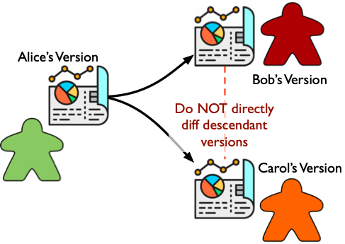
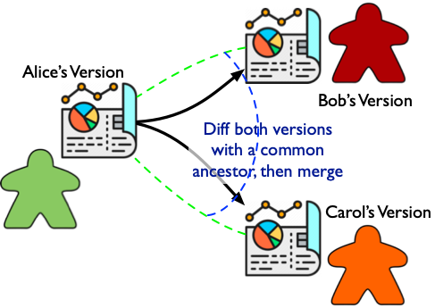

# DLogLite
_A Project Inspired by SQLite and Datomic_

This project is a kind of database in a single file, à la SQLite.

## SQLite Already Exists. Why DLogLite? Merging Concurrent Edits!

DLogLite's headline feature (beyond what one would expect from something like SQLite) is efficient and accurate merging of concurrently edited versions of a document/DB/file.

> __Ylvisaker's First Law of Merging Concurrent Edits: Conflicts are in the eye of the beholder__.
> Whenever you're merging concurrent edits, there is always the possibility of __conflicts__.
> This topic is big and complicated and we'll dig into details later.
> The first essential thing to take on board is: whether a collection of concurrent edits conflict with each other or not __CANNOT__ be completely defined at the system level.
> Some (perhaps even many) cases can be handled automagically by a smart generic system.
> However, in every sufficiently complex application there will be application-, document- and even user-specific semantics that influence whether particular edits represent a conflict or can be merged harmoniously.
>
> A couple consequences of YFLoMCE:
> - Frameworks like CRDTs (conflict-free replicated data types) are cool and interesting, but they cannot be a complete solution.
> - I think it's more important for a system to make it easy to mix in application-specific logic, rather than fully automating the simple cases.
>   (There's some famous quote, I think, about how the art of good system design is in making the hardest things less hard, rather than making the (relatively) easy things easier.)

## Step 1: Diffing Against a Common Ancestor

Let's say Alice has some big, complicated document.
Bob and Carol both make copies of Alice's version of the document and each edit their own copy.
Now Alice, Bob and Carol all want to merge these changes together.
One approach is to diff Bob's copy against Carol's copy, combine whatever differences seem to be harmonious with each other and identify potential conflicts for human review.
Unfortunately, this kind of direct diffing of modified versions is somewhat error-prone.
This approach is commonly used in contexts like plain text program code, but it is much trickier for structured documents like spreadsheets, diagrams/illustrations, etc.

I believe that a better foundation is what's sometimes called three-way merging.
That is, in order to merge Bob and Carol's versions, it's necessary to have some common ancestor version (like Alice's).
Both descendant versions can be diff'ed against the common ancestor and the deltas can be merged.

This three-way merging strategy can be implemented in an especially straight-forward way if the document is organized around entities/objects that have stable unique identifiers.
These unique identifiers make it easy to determine which entities have been added/modified/deleted/moved/duplicated between ancestor and descendant versions.
In contrast to quite complex diffing algorithms that try to infer connection points between versions based on document content/structure (e.g.
[KF-Diff](https://www.semanticscholar.org/paper/KF-Diff%2B%3A-Highly-Efficient-Change-Detection-for-XML-Xu-Wu/ee9f7f88920c31f1ee723f2f49fc8eb22eb1b8af),
[X-Diff](http://resources.mpi-inf.mpg.de/d5/teaching/ss03/xml-seminar/Material/wang_icde2003.pdf),
[RWS-Diff](https://db.in.tum.de/~finis/papers/RWS-Diff.pdf),
[Many home grown solutions](https://thume.ca/2017/06/17/tree-diffing/)),
relying on applications using unique entity identifiers in a reasonable way makes the ancestor-descendant diffing problem almost trivial.

## Step 2: Who's Got a Common Ancestor Lying Around? DLogLite Documents Do.

One of the technically challenging parts of this merging strategy is that you need a common ancestor to diff against.
In principle this could be provided by a version control system (like git).
However, requiring something like that could limit the usefulness of the format.
There are lots of applications where having everything in a self-contained file is very useful (the success of SQLite is compelling evidence for that).
So the first central design goal for DLogLite is that a document contains not just its most recent state/version, but __all previous versions__ as well.

__Small asterisk__: It is occasionally important to be able to _really delete_ something from a document.
For example, if someone accidentally commits some huge blob of data, or sensitive personal information needs to be purged.
So the default should be keeping all historical versions, but there should be a way to excise specific bits of data when necessary.

__Even smaller asterisk__: If a document has a _long_ history, it might make sense to trim off the oldest part of the chain for space efficiency.
This can be supported easily.

The simplest implementation of this idea is a linear chain/log of edits.
The problem with this approach is that reconstructing any particular historical version of the document requires _replaying_ the relevant edits.
For a document with a long history, this would make some operations unbearably slow.

The basic linear log can be improved by saving _complete copies_ of historical versions.
This saving of historical versions could quickly blow up the storage cost, __but__:
1. It's not necessary to have a complete copy for every version.
   If there is a complete copy _every so often_, then "in between" versions can be reconstructed by replaying just a few edits after the nearest ancestor complete copy.
2. Even more importantly, nearby versions of the document are typically __mostly the same__.
   If the document is implemented as a tree-shaped data structure, then functional/persistent tree update algorithms can be used to share most of the identical parts of different versions.

So at the storage layer, the implementation of DLogLite looks something like the following cartoon.
It's a chain of individual edits, some of which also refer to a complete copy of that particular version of the document.
The complete copies are trees that share a large amount of storage.

Each edit also has a hash calcualted from the concatenation of the previous edit's hash to the edit's own content.
This hash is an identifier for a particular version of the document.
While hash collisions are possible, with a reasonable hash function (like SHA-2) it's really fine to ignore that possibility.
This makes it efficient to find the most recent edit that two concurrently edited versions of a document share in common (i.e. the most recent common ancestor version).

__Actually quite important asterisk__: DLogLite documents are designed to contain their whole version history.
If there's some part of the document that changes frequently and transiently (i.e. you really don't care about the past versions of that particular part), this will cause a lot of garbage to build up in the document.
So application programmers need to think carefully about the persistent versus transient parts of the data in their application and only put the persistent parts into a DLogLite document.
We will probably discover plenty of awkward middle territory where some data is kinda transient, but also kinda persistent, and we'll have to think hard about that.

## Step 3: Slap a Data Model on that Thing

Working with raw edits and storage trees would be not so much fun for application programmers.
We really need a friendlier data model to put on top of that.
It would certainly be possible to do something in the relational family (like SQLite).
However, I've rather taken a shine to Datomic's interpretation of RDF triples, so that's the model that I think DLogLite should use.

In the DLogLite triple data model, you can think of the whole document/DB/file as a _single_ huge 2D table.
Each row is an entity/object/thing and each column in an attribute/property/predicate.
Each cell (i.e. row/column location) either has a value or is empty.
In many documents, it is likely that the table will be quite sparse (i.e. the vast majority of the cells are empty).

### Step 3a: Schema, Part 1: Column Attributes

Like conventional relational databases, there are two layers to DLogLite schemas.
Each attribute (i.e. column in the table) has some meta-attributes associated with it (like expected data types, whether entities should be efficiently searchable by that attribute, etc).
This puts constraints on the values in particular columns.
My intention here is to more or less copy the [design from Datomic](https://docs.datomic.com/on-prem/schema.html).

### Step 3b: Schema, Part 2: Entity Kinds

In addition to meta-attributes on columns, _entity kinds_ can also be defined.
If an entity is defined to be of a particular kind then some attributes will be required.
Other attributes may be allowed or disallowed, or specific optional attributes can be named.
Entity kinds play a role similar to _tables_ in conventional relational DBs.

## Step 4: Query with Datalog, but Probably Not Yet

One of the strengths of Datomic is its extremely flexible datalog-inspired query language.
Eventually I would like to develop a similarly flexible query engine.
However, in the short term some applications might be reasonably well served by a simple API that lets applications look up entities based on unique ID or some searchable attribute.

## Step 5: Oh Yeah, The Merging Part

The raison d'être of this project is merging concurrent edits.
One important design choice to make is the model of history.
That is, when two different versions are merged they will share some prefix of their edit chain, but those chains will presumeably diverge at some point (otherwise, why merge?).
What should the edit chain of the merged document look like?

I am currently leaning towards a relatively simple linear approach to history.
During a merge, the user has to choose which document is the trunk and which is the branch.
After the user has decided (with tool support) what the merged document will look like, a single edit is added to the trunk document that effective contains all the changes made in the branch document.

It would certainly also be possible to save the raw edits from the branch document off on the side somewhere.
I'm not certain what these branch edits would be used for, but it seems possible that they could be useful down the road.
(For example, for identifying who authored a particular change.)

### Step 5a: The Core Merging Algorithm is Really Simple

Just iterate through the entities, looking for changes.
The tree-based storage organization will make this extra-efficient for small changes made to documents with long histories.
In such a situation the versions being diffed will presumeably share whole big subtrees, which can be immediately skipped.

### Step 5b: Conflicts are in the Eye of the Beholder

...

## Step 6: An Implementation that is Reasonably Efficient

### Step 6a: A Shared Object Store for Functional Tree Update

By far the most important thing for getting a reasonably space efficient implementation of DLogLite is the trees.
Efficient implementations of functional/persistent/immutable trees have been extensively studied, and I expect to lean heavily on existing work for that.
The tricky part is memory/storage management.
The whole point of functional tree update is that multiple logically distinct trees can share identical subtrees.
That means that deciding when to deallocate/recycle memory/storage is decidedly non-trivial.
DLogLite needs to do its own shared object management.
I think basic reference count based garbage collection is the way to go.

### Step 6b: Building on SQLite (Because, Why Not?)

There's a moderate amount of complexity in managing the storage layer (i.e. interfacing with file systems and whatnot).
I think it's a good idea (at least for version 1) to use SQLite for this layer.
This will probably introduce some inefficiency, but it will make life so much simpler than writing low-level storage code from scratch.

### Step 6c: An Encoder for Nontrivial Data Kinds (I Like Transit)

Eventually it will probably be important to have encodings for nontrivial data kinds like vectors, sets, maps, unique keywords, dates, etc.
Certainly we don't want to completely reinvent the wheel here.
There are dozens of options (JSON, XML, MessagePack, protobufs, [etc, etc, etc](https://en.wikipedia.org/wiki/Comparison_of_data-serialization_formats)).
I'm fond of [Transit](https://github.com/cognitect/transit-format), but this is TBD.

### Step 6d: Compression

The storage format sketched in this document doesn't immediately lead to fantastic space efficiency.
However, I think there's a simple trick that will get us well within the bounds of reason for most applications.

Document elements are stored in trees.
Those trees can be chunked up into reasonably-sized subtrees.
Each subtree can be serialized independently and then run through an standard compression algorithm (Burrows–Wheeler, LZMA, whatever)

## Step 7: Optional Edit Authentication

It's pretty straight-forward to slap a digital signature on each edit.
This would give cryptographically strong authentication of edit authorship.
May not be useful in every application, but it doesn't cost much to add it.

Key management is a complex topic that I think it's safe to say is out of bounds for the core DLogLite project.

## Trivia: "DLogLite"

The name of this project is a combination of 3 ingredients:

- "SQLite" is obviously a big influence _and_ the foundation of the version 1 implementation.
- "Datalog" is the query language that I would eventually like to implement.
- Finally, the core data model is a "Log" of edits/transactions.

### Performance Concern 1: Efficient Access to the Current Document State

If all you had was a chain of transactions, it would be necessary to re-run them every time you wanted to do something useful with the data.
That would be terrible.
So each transaction in the chain can optionally include an index tree that represents the current state of the document in an efficiently queryable form.

### Performance Concern 2: Efficiently Storing Multiple Versions

Because these indexes are trees, we can use persistent data structure update to share most of the data between consecutive indexes.
Even with good persistent data structures, there would probably be a nontrivial space overhead to store an index with every transaction.
So probably it's a good idea to have bigger "gaps" in the chain between indexes the further back you go in the version history.

### Performance Concern 3: Deleting Data

By default old data never dies.
We want the normal case to be that any historical version of a document can be recreated, so obviously all of the data in that document version needs to be stored somewhere.
However sometimes it's desirable to fully expunge some data.
This is possible.

## Data Model: Largely Ripped Off from Datomic

## Querying

For now the only querying supported is extremely rudimentary, like looking up the attributes of a given entity.
As far as I know there aren't any important technical roadblocks to supporting more sophisticated querying with a dialect of datalog.
It's just a matter of effort.

